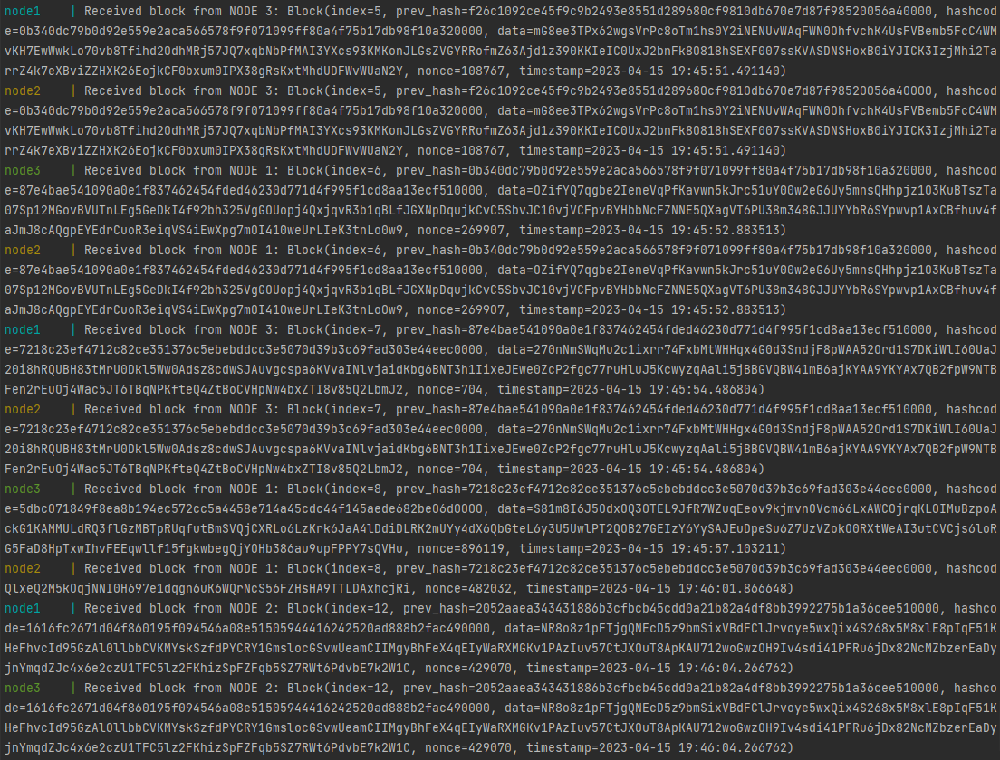

# Blockchain

main 

develop 

Блокчейн проект в рамках курсов "Разработка сетевых приложений" и "Тестирование ПО".

Блокчейн — это распределённая база данных, где каждый участник может хранить, просматривать, проверять но не удалять данные. 
Все данные разбиваются на блоки, и каждый блок имеет односвязную связность с предыдущими блоками, позволяющую 
верифицировать эти блоки. Верификацией занимаются узлы, которые и поддерживают работоспособность блокчейна.

Каждый блок состоит из следующих полей:

- `index` — номер блока по возрастают по порядку, начиная с 0 у `GENESIS`.
- `prev_hash` — хеш предыдущего блока.
- `hashcode` — хеш текущего блока. Должен заканчиваться на `0000`, вычисляется конкатенацией полей index, prev_hash, data и nonce.
- `data` — строка длинной случайных 256 символов.
- `nonce` — дополнение для соблюдения требования по хешированию.

Как только новый блок сгенерирован, нужно отправить его остальным нодам сети, и переходить к 
генерации следующего блока. В то же время, пока мы подбираем хеш, кто-то из соседних узлов мог добиться 
успеха в этом, и присылать нам свой блок. Тогда нужно проверить, что хеш посчитан правильно, и переходить к генерации 
нового блока используя полученный в качестве предыдущего (если хеш не правильный, или блок произведён от уже 
устаревшего блока — его нужно игнорировать).

## Docker

Клонирование репозитория:

`$ git clone https://github.com/irinareymer/Blockchain.git`

Сборка образа:

`$ docker-compose build`

Запуск Docker Compose:

`$ docker-compose up`

## Технические требования

Все требования представлены в `requirements.txt`

## Демонстрация работы

Через Docker Compose запускаются три ноды, `node1` генерирует первый блок `GENESIS`. Затем `node1` оповещает соседей о 
выпуске блока. Дальше начинается гонка между тремя нодами, кто первым рассчитает `hashcode` заканчивающийся на `0000` 
для следующего блока, и отправит эту информацию в сеть.

По результатам работы видно, что создан блок `GENESIS`, который проинициализирован на всех нодах.
Далее следует информация от пары нод, о получении нового блока: `node3` и `node2` получили от `node1` блок с индексом 1, 
`node3` и `node1` получили от `node2` блок с индексом 2 и так далее.

Полученные цепочки блоков являются валидными, так как у каждого блока поле `prev_hash` совпадает с полем `hashcode` 
предыдущего блока в цепи. Также у сгенерированных блоков `hashcode` заканчивается на `0000`, что соответствует требованиям задачи. 
